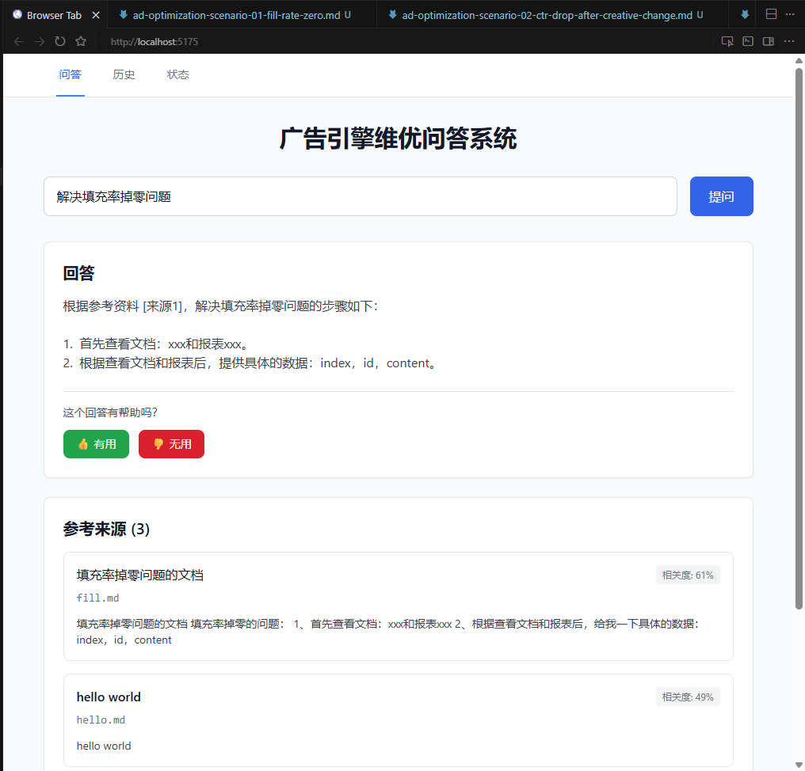
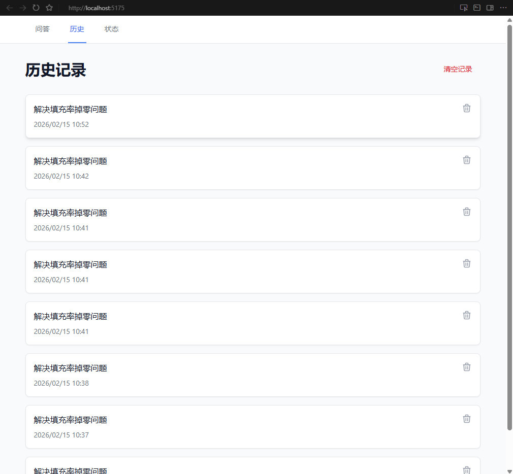
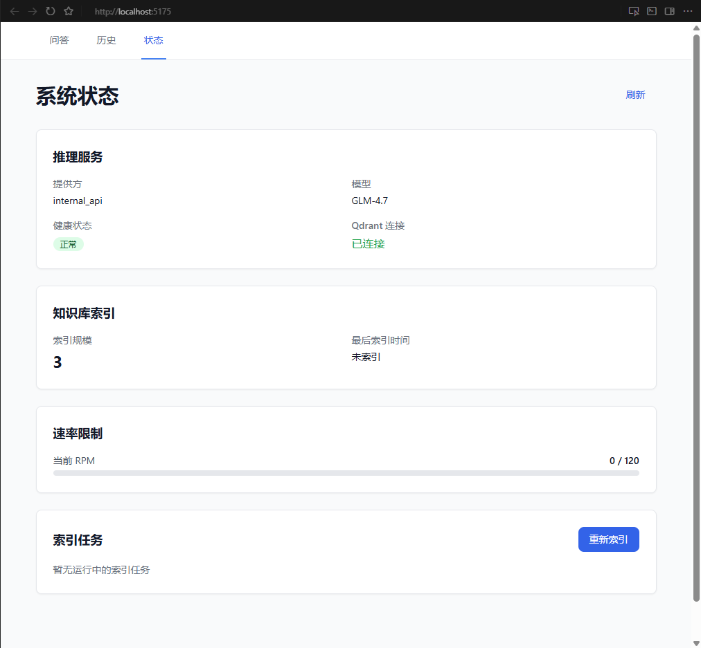
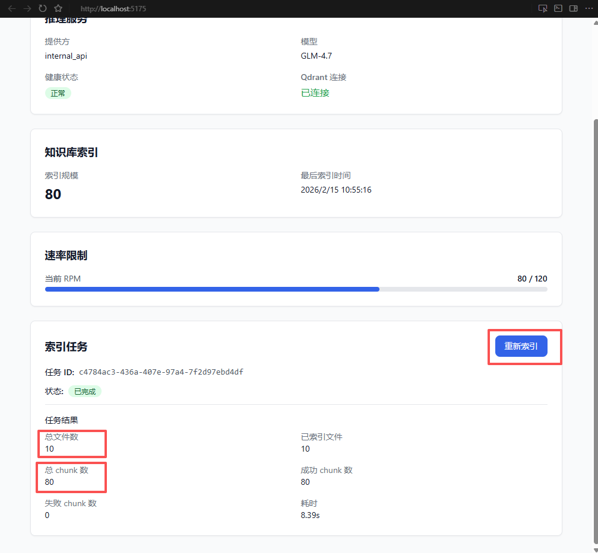

# EngineQA

广告引擎现网维优 QA 问答系统（Internal API 推理版）。

## 当前实现状态（2026-02-14）
- 默认运行基线：`backend-python/`（FastAPI + Qdrant embedded）。
- Rust 后端：`backend/` 已完成向量存储重构，检索与索引链路使用 LanceDB 本地存储。
- 统一入口脚本：`scripts/dev.sh`，通过 `BACKEND_RUNTIME` 切换运行时，或者使用`make dev`、`make dev-python`、`make dev-rust`来启动后端

## 目录结构
- `frontend/`: React + Vite + Tailwind 前端。
- `backend-python/`: Python FastAPI 后端（默认）。
- `backend/`: Rust Axum 后端（LanceDB 向量存储）。
- `docs/`: 启动、部署、验收、运维文档。
- `scripts/`: 启动、冒烟、验收、压测、安全检查脚本。
- `knowledge/`: Markdown 知识库目录。

## 端口约定
- Frontend: `5173`
- Backend: `8080`

## 快速启动（Host-Run，推荐）
1. 安装前端依赖：
```bash
npm install --prefix frontend
```

2. 初始化环境变量：
```bash
cp .env.example .env
```

3. 至少配置以下必填项：
- `INTERNAL_API_BASE_URL`
- `INTERNAL_API_TOKEN`

4. 按运行时准备依赖：

Python（默认）
```bash
python3 -m venv .venv-backend-python
.venv-backend-python/bin/pip install -r backend-python/requirements.txt
make dev
```

Rust（LanceDB）
```bash
cargo build --manifest-path backend/Cargo.toml
BACKEND_RUNTIME=rust make dev
```

5. 等价命令（统一入口）：
```bash
make dev                # 默认 python
make dev-python
make dev-rust
```

## 运行验证
健康检查：
```bash
curl -fsS http://127.0.0.1:8080/health
curl -fsS http://127.0.0.1:5173 >/dev/null
curl -fsS http://127.0.0.1:8080/api/status
```

Step-01 冒烟：
```bash
BACKEND_RUNTIME=python ./scripts/smoke-step-01.sh
BACKEND_RUNTIME=rust ./scripts/smoke-step-01.sh
```

## 前端页面说明（含图片预留）
### 1. 问答页面（Query）
- 用途：输入广告引擎维优问题，查看模型回答与参考片段。
- 建议操作：在该页面逐条执行“知识库测试问题（Top 10）”中的问题，观察回答质量与引用内容。



### 2. 历史页面（History）
- 用途：查看历史问答记录，便于复盘问题、答案与效果反馈。
- 建议操作：按时间或关键词回看测试问题结果，定位不稳定问答。



### 3. 状态页面（Status）
- 用途：查看服务状态、运行时信息与系统健康情况。
- 建议操作：在执行批量测试前后，先确认系统状态正常。



### 4. 重新索引功能说明（位于 Status 页）
- 功能：触发知识库重新索引，使新增/更新的 `knowledge/` 文档生效。
- 适用场景：
  - 新增了场景化知识文档后。
  - 修改了文档内容但回答仍命中旧版本时。
  - 需要重建检索数据以验证回归结果时。
- 建议流程：
  1. 在 Status 页面触发重新索引。
  2. 等待状态变为完成（completed）。
  3. 返回 Query 页面重新提问验证命中效果。



## 知识库测试问题（广告引擎维优 Top 10）
在前端界面中测试建议流程：
1. 打开 Query 页面（或提问输入框）。
2. 逐条输入下面问题并提交。
3. 检查回答是否引用了相关场景文档，且结论与“关键观测/根因/排查步骤”一致。
4. 对不准确回答记录问题与 trace_id，便于回放与优化。

建议回归问题集（10 条）：
- 填充率突然归零但请求量正常，一般先看哪三个指标？
- 素材替换后曝光不变点击下降，如何快速定位问题？
- CTR 稳定但 CVR 下滑，怎么判断是落地页还是回传链路问题？
- CPM 在短时段大幅上涨时，先排查哪些出价与竞争指标？
- 日预算花不出去时，如何区分频控过严与定向过窄？
- 如何识别 CTR 下滑是否由频次疲劳引起？
- 新计划冷启动无曝光，应该先调出价还是先放宽定向？
- 地域定向错配时，如何验证配置已正确下发生效？
- 时段投放异常集中在凌晨，如何排查时区或模板错误？
- 转化回传延迟为什么会导致智能出价误判？如何验证？

## 关键环境变量
通用：
- `INTERNAL_API_BASE_URL`
- `INTERNAL_API_TOKEN`
- `INTERNAL_API_CHAT_PATH`
- `INTERNAL_API_EMBED_PATH`
- `EMBEDDING_VECTOR_SIZE`

Rust + LanceDB：
- `VECTOR_STORE=lancedb`
- `LANCEDB_URI=./.lancedb`
- `LANCEDB_TABLE=knowledge_chunks`
- `VECTOR_SCORE_THRESHOLD=0.3`

Python + Qdrant：
- `QDRANT_LOCAL_PATH=./.qdrant-local`
- `QDRANT_COLLECTION=knowledge_chunks`

## API 清单
- `GET /health`
- `POST /api/query`
- `GET /api/status`
- `POST /api/feedback`
- `POST /api/reindex`
- `GET /api/reindex`

## 常用脚本
- `scripts/dev.sh`: 统一入口（根据 `BACKEND_RUNTIME` 分发）。
- `scripts/dev-python.sh`: 启动 Python 后端 + 前端。
- `scripts/dev-rust.sh`: 启动 Rust 后端 + 前端（LanceDB）。
- `scripts/smoke-step-01.sh`: 基础冒烟（运行时感知）。
- `scripts/smoke-step-13.sh`: Step-13 冒烟（状态接口感知向量存储）。
- `scripts/acceptance-test.sh`: 验收测试。
- `scripts/security-check.sh`: 安全检查。
